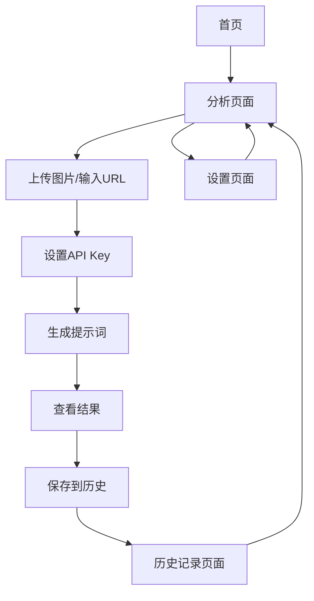

# 图片反推提示词应用 - 产品需求文档

## 1. 产品概述

一个基于AI的图片分析工具，用户可以上传图片或提供图片URL，系统通过OpenRouter API调用大语言模型分析图片内容并生成详细的提示词描述。
该产品主要解决设计师、内容创作者和AI绘画爱好者需要快速获取图片描述和提示词的需求，帮助用户更好地理解和复用图片元素。
产品目标是成为专业的图片分析和提示词生成平台，提升用户的创作效率和灵感获取能力。

## 2. 核心功能

### 2.1 用户角色

| 角色 | 注册方式 | 核心权限 |
|------|----------|----------|
| 普通用户 | 无需注册，直接使用 | 可上传图片、设置API Key、查看生成结果、管理历史记录 |

### 2.2 功能模块

我们的图片反推提示词应用包含以下主要页面：
1. **首页**：产品介绍、功能展示、快速开始引导
2. **分析页面**：图片上传区域、URL输入、API Key设置、结果展示
3. **历史记录页面**：历史分析记录、结果管理、导出功能
4. **设置页面**：API Key管理、偏好设置、使用统计

### 2.3 页面详情

| 页面名称 | 模块名称 | 功能描述 |
|----------|----------|----------|
| 首页 | 产品介绍区 | 展示产品核心价值、使用场景、功能特点 |
| 首页 | 快速体验区 | 提供示例图片快速体验功能 |
| 首页 | 导航菜单 | 页面导航、功能入口 |
| 分析页面 | 图片上传区 | 支持拖拽上传、文件选择、图片预览、格式验证 |
| 分析页面 | URL输入区 | 图片链接输入、URL验证、图片加载预览 |
| 分析页面 | API设置区 | OpenRouter API Key配置、模型选择、参数调整 |
| 分析页面 | 结果展示区 | 生成的提示词显示、复制功能、保存到历史 |
| 分析页面 | 图床集成 | 自动上传到第三方图床、获取公开URL |
| 历史记录页面 | 记录列表 | 显示历史分析记录、缩略图、生成时间 |
| 历史记录页面 | 搜索筛选 | 按时间、关键词搜索历史记录 |
| 历史记录页面 | 批量操作 | 批量删除、导出、分享功能 |
| 设置页面 | API管理 | API Key保存、验证、使用统计 |
| 设置页面 | 偏好设置 | 默认模型、输出格式、语言偏好 |

## 3. 核心流程

**主要用户操作流程：**

1. **图片分析流程**：用户进入分析页面 → 上传图片或输入URL → 设置API Key（首次使用）→ 点击分析 → 查看生成的提示词 → 保存到历史记录
2. **历史管理流程**：用户进入历史记录页面 → 浏览历史记录 → 搜索特定记录 → 查看详情或批量操作
3. **设置管理流程**：用户进入设置页面 → 配置API Key → 调整偏好设置 → 查看使用统计

## 4. 用户界面设计

### 4.1 设计风格

- **主色调**：深蓝色 (#1e40af) 和亮蓝色 (#3b82f6)，辅助色为灰色系 (#6b7280, #f3f4f6)
- **按钮样式**：圆角按钮，悬停效果，渐变背景
- **字体**：主要使用 Inter 字体，中文使用系统默认字体，标题 18-24px，正文 14-16px
- **布局风格**：卡片式设计，顶部导航，响应式网格布局
- **图标风格**：使用 Heroicons 或 Lucide 图标库，简洁线性风格

### 4.2 页面设计概览

| 页面名称 | 模块名称 | UI元素 |
|----------|----------|--------|
| 首页 | 产品介绍区 | 大标题、副标题、特性卡片、渐变背景、CTA按钮 |
| 首页 | 快速体验区 | 示例图片网格、悬停效果、快速分析按钮 |
| 分析页面 | 图片上传区 | 虚线边框拖拽区域、上传图标、进度条、图片预览 |
| 分析页面 | 结果展示区 | 白色卡片背景、代码块样式、复制按钮、标签展示 |
| 历史记录页面 | 记录列表 | 时间线布局、缩略图、元数据标签、操作按钮 |
| 设置页面 | API管理 | 输入框、验证状态指示、使用统计图表 |

### 4.3 响应式设计

产品采用移动优先的响应式设计，支持桌面端、平板和手机端访问，针对触屏设备优化交互体验，包括拖拽上传和手势操作。