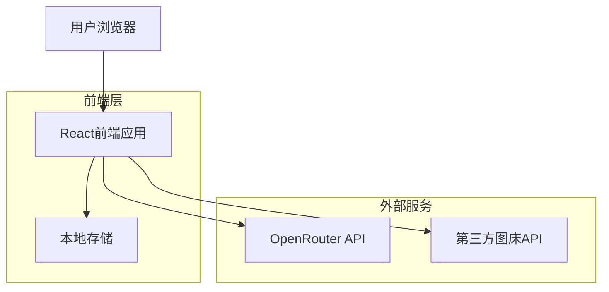
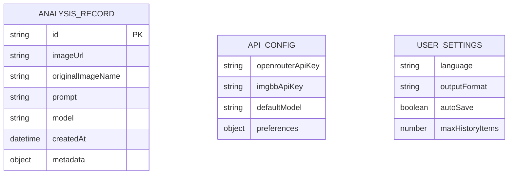

# 图片反推提示词应用 - 技术架构文档

## 1. 架构设计



## 2. 技术描述

- **前端**: React@18 + TypeScript@5 + Tailwind CSS@3 + Vite@5
- **状态管理**: React Context API + useReducer
- **HTTP客户端**: Axios@1.6
- **图片处理**: react-dropzone@14 + browser-image-compression@2
- **UI组件**: Headless UI@1.7 + Heroicons@2
- **后端**: 无（纯前端应用）

## 3. 路由定义

| 路由 | 用途 |
|------|------|
| / | 首页，展示产品介绍和快速体验功能 |
| /analyze | 分析页面，图片上传和提示词生成的主要工作区 |
| /history | 历史记录页面，查看和管理过往的分析结果 |
| /settings | 设置页面，API Key管理和偏好配置 |

## 4. API定义

### 4.1 核心API

**OpenRouter API集成**
```
POST https://openrouter.ai/api/v1/chat/completions
```

请求参数:
| 参数名称 | 参数类型 | 是否必需 | 描述 |
|----------|----------|----------|------|
| model | string | true | 使用的模型，默认为 "meta-llama/llama-4-maverick:free" |
| messages | array | true | 消息数组，包含文本和图片内容 |

响应参数:
| 参数名称 | 参数类型 | 描述 |
|----------|----------|------|
| choices | array | 模型生成的回复选项 |
| usage | object | API使用统计信息 |

请求示例:
```json
{
  "model": "meta-llama/llama-4-maverick:free",
  "messages": [
    {
      "role": "user",
      "content": [
        {
          "type": "text",
          "text": "请详细描述这张图片的内容，并生成适合AI绘画的提示词"
        },
        {
          "type": "image_url",
          "image_url": {
            "url": "https://example.com/image.jpg"
          }
        }
      ]
    }
  ]
}
```

**第三方图床API (ImgBB)**
```
POST https://api.imgbb.com/1/upload
```

请求参数:
| 参数名称 | 参数类型 | 是否必需 | 描述 |
|----------|----------|----------|------|
| key | string | true | ImgBB API密钥 |
| image | string | true | Base64编码的图片数据 |
| name | string | false | 图片名称 |

响应参数:
| 参数名称 | 参数类型 | 描述 |
|----------|----------|------|
| data.url | string | 图片的公开访问URL |
| data.display_url | string | 图片的显示URL |

## 5. 数据模型

### 5.1 数据模型定义



### 5.2 本地存储数据结构

**分析记录存储 (localStorage: 'analysis_history')**
```typescript
interface AnalysisRecord {
  id: string;
  imageUrl: string;
  originalImageName?: string;
  prompt: string;
  model: string;
  createdAt: string;
  metadata: {
    fileSize?: number;
    dimensions?: { width: number; height: number };
    processingTime?: number;
  };
}
```

**API配置存储 (localStorage: 'api_config')**
```typescript
interface ApiConfig {
  openrouterApiKey: string;
  imgbbApiKey?: string;
  defaultModel: string;
  preferences: {
    promptLanguage: 'zh' | 'en';
    outputFormat: 'detailed' | 'concise';
    autoUploadToImgbb: boolean;
  };
}
```

**用户设置存储 (localStorage: 'user_settings')**
```typescript
interface UserSettings {
  language: 'zh' | 'en';
  theme: 'light' | 'dark' | 'auto';
  autoSave: boolean;
  maxHistoryItems: number;
  compressionQuality: number;
}
```

### 5.3 核心类型定义

```typescript
// 图片上传相关
interface ImageUpload {
  file: File;
  preview: string;
  compressed?: File;
  uploadedUrl?: string;
}

// API响应类型
interface OpenRouterResponse {
  choices: Array<{
    message: {
      content: string;
      role: string;
    };
  }>;
  usage: {
    prompt_tokens: number;
    completion_tokens: number;
    total_tokens: number;
  };
}

// 应用状态类型
interface AppState {
  currentImage: ImageUpload | null;
  isAnalyzing: boolean;
  analysisResult: string | null;
  history: AnalysisRecord[];
  apiConfig: ApiConfig;
  userSettings: UserSettings;
}
```